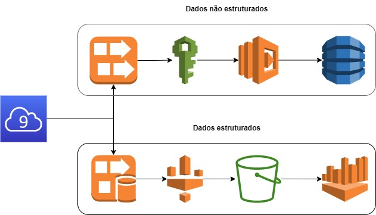
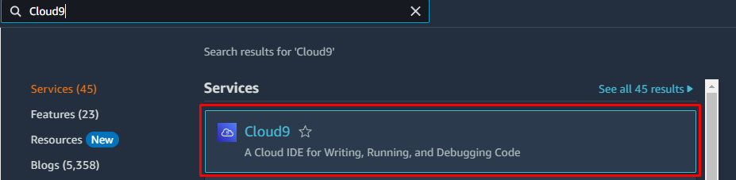
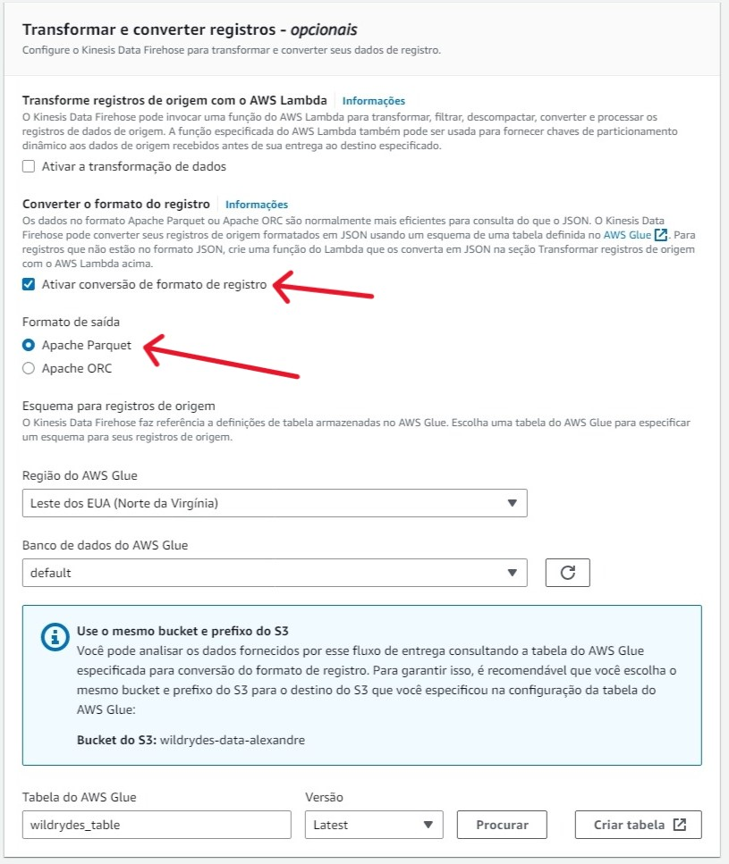
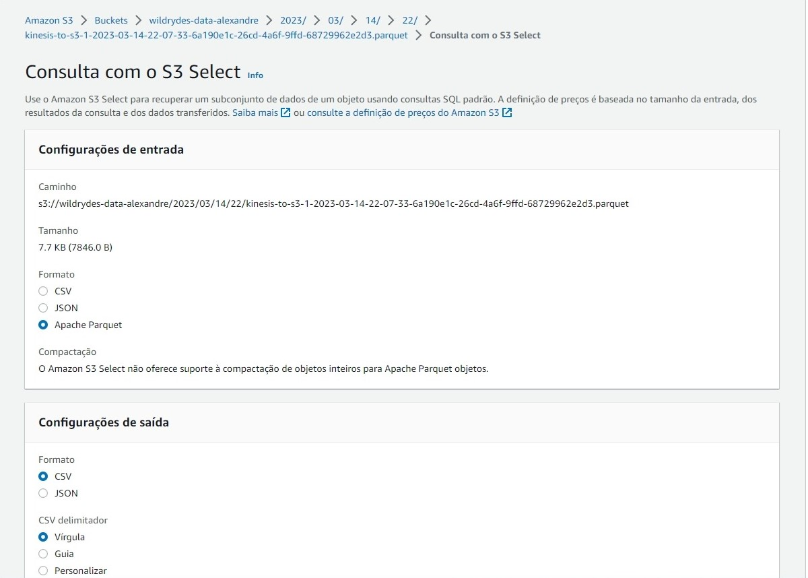

## Sumário
+ [Introdução](#Introducao)
    + [Links](#Links)
        + [Link para o projeto no Notion](#Notion)
        + [Link para o projeto no Site](#Site)
    + [Arquitetura do projeto](#Arquitetura-do-projeto)
    + [Criando o serviço Cloud9](#Cloud9)
    + [Rodando o Producer e Consumer](#ProducerConsumer)
+ [Pipeline com dados não estruturados](#PipelineNaoEstruturado)
    + [Criando o serviço Kinesis Data Streams](#CriacaoDataStreams)
    + [Criando uma tabela no DynamoDB](#CriacaoDynamoDB)
    + [Administrando políticas de segurança com o IAM](#IAM)
        + [Criação da política](#Politica)
        + [Criação da função](#Funcao)
    + [Criando uma função com o serviço Lambda](#FuncaoLambda)
    + [Processando dados não estruturados (Data Streams, DynamoDB e Lambda)](#ProcessandoNaoEstruturado)
+ [Pipeline com dados estruturados](#PipelineEstruturados)
    + [Criando um bucket S3](#S3)
    + [Criando uma tabela no Glue](#Glue)
    + [Criando o serviço Kinesis Data Firehose](#Firehose)
    + [Processando dados estruturados (S3, Glue e Data Firehose)](#ProcessandoEstruturados)
    + [Criando e fazendo consultas com o Athena](#Athena)

# Introdução <a name = "Introducao"></a>

## Links <a name = "Links"></a>
Link para o projeto no 
[Notion](https://alexandremcastro.notion.site/02-2023-AWS-Data-Lake-Serverless-c8f8198221134364991976c26ee1a985)  <a name = "Notion"></a>

Link para o projeto no
[Site](https://alexandre-castro.vercel.app/blog/datalake-serverless) <a name = "Site"></a>

## Arquitetura do projeto <a name = "Arquitetura-do-projeto"></a>

A proposta desse projeto é fornecer um Data Lake em nuvem, Serverless, utilizando os serviços da Amazon Web Services.



<br>

## Criando o serviço Cloud9 <a name = "Cloud9"></a>

Para que é usado o serviço Cloud9? Ele fornece um terminal de comando para uma instância EC2. Isso é essencial neste projeto, pois será nele que serão gerados os dados para consumo

Vá no painel e na pesquisa procure e clique no serviço Cloud9



Você será redirecionado a essa tela

Clique em: `Criar ambiente`


Coloque um nome para identificação, a descrição é opcional

Mantenha as outras opções em padrão


<aside>
💡 Verifique se a instância que está sendo criada é coberta pelo nível gratuito.
</aside>

<br>


Para criar a o Cloud9, clique em `Criar`


Para acessar o terminal criado pelo Cloud9, clique em: `Em aberto`


A criação do serviço demora alguns minutos, pois ainda será criado o serviço EC2 simultaneamente. Ao criar você será redirecionado para essa tela:


É importante manter essa tela aberta até o fim do projeto, nela que será rodado o script responsável por gerar os dados para o Data Lake

<br>

## Rodando o Producer e Consumer <a name = "ProducerConsumer"></a> 
### Baixando o Producer e Consumer 

Para baixar o Producer/Consumer, abra a janela com o terminal do Cloud9 e rode o comando:

```bash
curl -s [https://data-processing.serverlessworkshops.io/client/client.tar](https://data-processing.serverlessworkshops.io/client/client.tar) | tar -xv
```


Essa etapa será repetida algumas vezes, então é de extrema importância saber como realizar ela até o fim do projeto

<br>

### Producer

O Producer é responsável por simular os dados dos sensores nos cavalos, é um script fornecido pela AWS feito em Go, já compilado.

Para começar gerar os dados, abra o terminal do Cloud9 e rode o comando:

```bash
./producer
```


<br>

### Consumer

O Consumer é responsável por consumir os dados dos sensores nos cavalos, neste caso, o Consumer está lendo os dados gerados pelo Producer, o Consumer também é um script fornecido pela AWS feito em Go, já compilado.

Para verificar se está tudo funcionando corretamente, abra uma nova janela do terminal e rode o comando:

```bash
./consumer
```


Para parar de rodar ambos, faça o comando: `CTRL + C`

<br>

# Pipeline com dados não estruturados <a name = "PipelineNaoEstruturado"></a>

## Criando o serviço Kinesis Data Streams <a name = "CriacaoDataStreams"></a>

Para que é usado o serviço Kinesis? O AWS Kinesis é um serviço de streaming de dados, usado para coletar, processar e analisar grandes volumes de dados em tempo real.

O Kinesis Data Streams será necessário no projeto para capturar os dados gerados pelo Producer.

Vá no painel e na barra pesquisa procure por `Kinesis`

Clique em: `Kinesis`


Nesta tela, selecione: `Kinesis Data Streams` 

Em seguida, selecione: `Criar fluxo de dados`


Insira o nome do fluxo de dados como: `wildrydes`

Selecione a capacidade do fluxo de dados para: `Provisionado`

Mantenha as outras opções em padrão

Em seguida clique em: `Criar fluxo de dados`


<br>

## Criando uma tabela no DynamoDB <a name = "CriacaoDynamoDB"></a>

Para que é usado o serviço DynamoDB? O AWS DynamoDB é um serviço de banco de dados NoSQL, que permite armazenar e recuperar grandes volumes de dados de forma rápida e escalável, sem a necessidade de provisionar ou gerenciar servidores. Ele será uma das fontes de armazenamentos de dados do Data Lake.

Vá no painel e na barra pesquisa procure por `DynamoDB`

Clique em: `DynamoDB`


Para criar a tabela que receberemos os dados, clique em: `Criar tabela`


Como nome da tabela utilize o nome: `UnicornSensorData`

Como chave de partição utilize: `Name`

Como chave de classificação utilize: `StatusTime`


As próximas opções são padrão

Ao fim da página, clique em: `Criar tabela`


<br>

## Administrando políticas de segurança com o IAM <a name = "IAM"></a>

Para que é usado o serviço IAM? O AWS IAM (Identity and Access Management) é um serviço de gerenciamento de identidade e acesso, usado para gerenciar o acesso a recursos da AWS de forma segura, permitindo gerenciar usuários, grupos e permissões de acesso aos serviços.

Vá no painel e na barra pesquisa procure por `IAM`

Clique em: `IAM`


<br>

### Criação da política <a name = "Politica"></a>

Criarei uma politica para o DynamoDB permitir a gravação de dados na tabela criada.

Na página redirecionada, clique em: `Politicas`


Em seguida clique em: `Criar politica`


No serviço, selecione: `DynamoDB`

Nas ações, selecione: `BatchWriteItem`


Em recursos, selecione: `Adicionar ARN`


Para preencher essa tabela, é necessário do código ARN da tabela criada no DynamoDB


Para ter acesso ao ARN da tabela no DynamoDB, vá no serviço e clique na tabela que foi criada


O ARN fica localizado nas informações gerais da tabela

Copie o código ARN


Cole o código ARN e todas as informações serão preenchidas automaticamente

Clique em: `Adicionar`


Prosseguindo a criação da política

Clique em: `Próximo: Tags`


Clique em: `Próximo: Revisar`


Em nome, insira: `WildRydesDynamoDBWritePolicy`

Após, clique em: `Criar política`


<br>

### Criação da função <a name = "Funcao"></a>

Agora irei criar uma função para o Lambda se comunicar com o Kinesis e DynamoDB utilizando as politicas:`WildRydesDynamoDBWritePolicy` e `AWSLambdaKinesisExecutionRole`

Clique em: `Funções`

Depois clique em: `Criar função`


Em caso de uso, selecione `Lambda`

Depois clique em: `Próximo`


Pesquise pela política `AWSLambdaKinesisExecutionRole`

Selecione a política: `AWSLambdaKinesisExecutionRole`


Pesquise pela política `WildRydesDynamoDBWritePolicy`

Selecione a política: `WildRydesDynamoDBWritePolicy`


Confirme se as duas políticas estão selecionadas


Prossiga a criação da função

Selecione: `Próximo`


Em nome da função, insira: `WildRydesStreamProcessorRole`


Verifique as políticas selecionadas

Selecione: `Criar função`


Verifique se a função foi criada


<br>

## Criando uma função com o serviço Lambda <a name = "FuncaoLambda"></a>

Para que é usado o serviço Lambda? É um serviço para rodar códigos de diversas linguagens diferentes, nele rodará o código que será responsável por trazer os dados do Kinesis e levar para o DynamoDB.

Vá no painel e na barra pesquisa procure por `Lambda`

Clique em: `Lambda`


Clique em: `Criar uma função`


Em nome da função, insira o nome: `WildRydesStreamProcessor`

Selecione abaixo a opção de execução: `Node.js 14.x`


No papel de execução, selecione a opção: `Usar uma função existente`

Na função, selecione a `WildRydesStreamProcessorRole`, criada anteriormente na seção do IAM

Em seguida, selecione: `Criar função`


Na parte de código, insira o código a seguir:

```jsx
"use strict";

const AWS = require("aws-sdk");
const dynamoDB = new AWS.DynamoDB.DocumentClient();
const tableName = process.env.TABLE_NAME;

exports.handler = function (event, context, callback) {
    const requestItems = buildRequestItems(event.Records);
    const requests = buildRequests(requestItems);

    Promise.all(requests)
        .then(() =>
            callback(null, `Delivered ${event.Records.length} records`)
        )
        .catch(callback);
};

function buildRequestItems(records) {
    return records.map((record) => {
        const json = Buffer.from(record.kinesis.data, "base64").toString(
            "ascii"
        );
        const item = JSON.parse(json);

        return {
            PutRequest: {
                Item: item,
            },
        };
    });
}

function buildRequests(requestItems) {
    const requests = [];
    // Batch Write 25 request items from the beginning of the list at a time
    while (requestItems.length > 0) {
        const request = batchWrite(requestItems.splice(0, 25));

        requests.push(request);
    }

    return requests;
}

function batchWrite(requestItems, attempt = 0) {
    const params = {
        RequestItems: {
            [tableName]: requestItems,
        },
    };

    let delay = 0;

    if (attempt > 0) {
        delay = 50 * Math.pow(2, attempt);
    }

    return new Promise(function (resolve, reject) {
        setTimeout(function () {
            dynamoDB
                .batchWrite(params)
                .promise()
                .then(function (data) {
                    if (data.UnprocessedItems.hasOwnProperty(tableName)) {
                        return batchWrite(
                            data.UnprocessedItems[tableName],
                            attempt + 1
                        );
                    }
                })
                .then(resolve)
                .catch(reject);
        }, delay);
    });
}
```


Antes do Deploy, vá nas configurações de variáveis de ambiente

Clique em: `Editar`


**Primeira variável de ambiente**

Clique em: `Adicionar variáveis de ambiente`

Na primeira variável de ambiente, insira:

Chave: `TABLE_NAME`

Valor: `UnicornSensorData`

<br>

**Segunda variável de ambiente**

Clique em: `Adicionar variáveis de ambiente`

Na segunda variável de ambiente, insira:

Chave: `AWS_NODEJS_CONNECTION_REUSE_ENABLED`

Valor: `1`

Clique em: `Salvar`


Adicionando o Kinesis na função

Clique em: `Adicionar gatilho`


Selecione o serviço: `Kinesis` 

Em Stream do Kinesis, insira o stream criado anteriormente no Kinesis Data Streams


Mantenha o tamanho do lote em 100

Clique em: `Adicionar`


Com tudo configurado, farei o Deploy da função

Vá na aba Código e clique em: `Deploy`


<br>

## Processando dados não estruturados **(Data Streams, DynamoDB e Lambda)** <a name = "ProcessandoNaoEstruturado"></a>

Com o Kinesis, DynamoDB, IAM e Lambda criados e configurados, agora é possível fazer o processamento dos dados gerados pelo script Producer.

Com o Cloud9 aberto, rode o Producer, mencionando o stream criado no Kinesis

```bash
./producer -stream wildrydes
```

Rode o Consumer e verifique a produção dos dados


Na aba `Monitor`, verifique se os dados estão sendo capturados


Para verificar se os dados estão sendo entregues, abra o serviço `DynamoDB`

Vá na aba tabelas e selecione a tabela `UnicornSensorData`


Clique em: `Explorar itens da tabela`


Verifique se os dados foram preenchidos


<br>

# Pipeline com dados estruturados <a name = "PipelineEstruturados"></a>

## Criando um bucket S3 <a name = "S3"></a>

Para que é usado o serviço S3? O S3 é um sistema de armazenamento, nele pode ser armazenado qualquer tipo de arquivo

Depois de ter enviado os dados para o DynamoDB, temos a opção de enviar eles para o S3

Vá no painel e na barra pesquisa procure por `S3`

Clique em: `S3`


Clique em: `Criar bucket`


<aside>
💡 Ao nomear o bucket, de um nome inexistente até o momento, o nome do bucket deve ser globalmente exclusivo.

</aside>

Insira o nome do bucket

Em Região da AWS, selecione: `Leste dos EUA (Norte da Virgínia) us-east-1`


Mantenha as outras configurações padrões

Clique em: `Criar bucket`


<br>

## Criando uma tabela no Glue <a name = "Glue"></a>

Para que é usado o serviço Glue? O Glue é um serviço de integração de dados, nele será possível capturar os dados vindo do Kinesis e levando ele ao bucket S3.

Vá no painel e na barra pesquisa procure por `Glue`

Clique em: `AWS Glue`


Vá na aba `Tables`, em Data Catalog

Clique em: `Add table`


Em Table details, insira um nome para a tabela

Em Database, selecione: `default`

<aside>
💡 Caso não apareça nenhum banco de dados, crie um no botão: `Create database`

</aside>


Em Data Store, selecione a opção: `S3`

Depois selecione onde está localizado o bucket, clique em: `Browse S3`


Selecione o bucket criado anteriormente

Clique em: `Choose`


Em Data format, selecione o formato: `Parquet`

Clique em: `Next`


Para definir o schema, clique em: `Add`


O schema deve ser baseado nas informações geradas pelo Producer


Insira cada coluna do schema, seguindo a ordem de saída gerada pelo Producer e seguindo os tipos de dados.


Repita esse processo para todas as colunas

| Coluna | Tipo |
| --- | --- |
| Distance | float |
| HealthPoints | int |
| Latitude | float |
| Longitude | float |
| MagicPoints | int |
| Name | string |
| InputData | string |
| StatusTime | timestamp |


Mantenha as outras configurações em padrão

Clique em: `Next`


Verifique se tudo está corretamente configurado

Clique em: `Create`


<br>

## Criando o serviço Kinesis Data Firehose <a name = "Firehose"></a>

Vá no painel e na barra pesquisa procure por `Kinesis`

Clique em: `Kinesis`


Clique em: `Criar stream de entrega`


Na origem, selecione: `Amazon Kinesis Data Streams`

No destino, selecione: `Amazon S3`


Na configuração da origem, clique em: `Browse`


Selecione o Data stream criado anteriormente

Clique em: `Choose`


Insira um nome para o fluxo de entrega


Em transformar e converter registros, selecione: `Ativar conversão de formato de registro`

Em formato de saída, selecione: `Apache Parquet`

Em região, selecione `Leste dos EUA (Norte da Virgínia)`

Em banco de dados do AWS Glue, selecione o banco de dados criado no Glue

Em tabela do AWS Glue, selecione a tabela criada no Glue



Em configurações do destino, clique em: `Browse`


Selecione o bucket criado anteriormente

Clique em: `Choose`


Em intervalo do buffer, coloque `60`


Clique em: `Criar fluxo de entrega`


<br>

## Processando dados estruturados **(S3, Glue e Data Firehose)** <a name = "ProcessandoEstruturados"></a>

Com tudo configurado, agora é os dados gerados pelo Producer, serão enviados diretamente para o S3.

Para isso, rode o Producer indicando o nome do Stream

```bash
./producer -stream wildrydes
```

Deixe alguns minutos rodando

Acesse o bucket criado e cheque se foi criado um diretório


Siga até o último destino e verifique se lá possuem os objetos `.parquet`


Clique em qualquer objeto

Dentro do objeto, clique em: `Consulta com o S3 Select`


Em configurações de entrada, selecione o formato: `Apache Parquet`

Em configurações de saída, selecione o formato: `CSV`



Em consulta SQL, selecione: `Executar consulta SQL`

Em resultados da consulta, verifique se o resultado da consulta, batem com os mesmos dados gerados pelo Producer.


<br>

## Criando e fazendo consultas com o Athena <a name = "Athena"></a>

Para que é usado o serviço Athena? Com o Athena é possível analisar dados, utilizando consultas em SQL, é possível utilizar como fonte de dados o S3 e outros serviços

Vá no painel e na pesquisa procure e clique no serviço Athena


Selecione: `Query your data`


Verifique se o database selecionado é o que foi criado anteriormente

Verifique se a tabela selecionada é a que foi criada anteriormente

Faça uma consulta simples, verificando se está tudo funcionando corretamente

```sql
SELECT * FROM wildrydes_table
```


Clique em: `Run`


